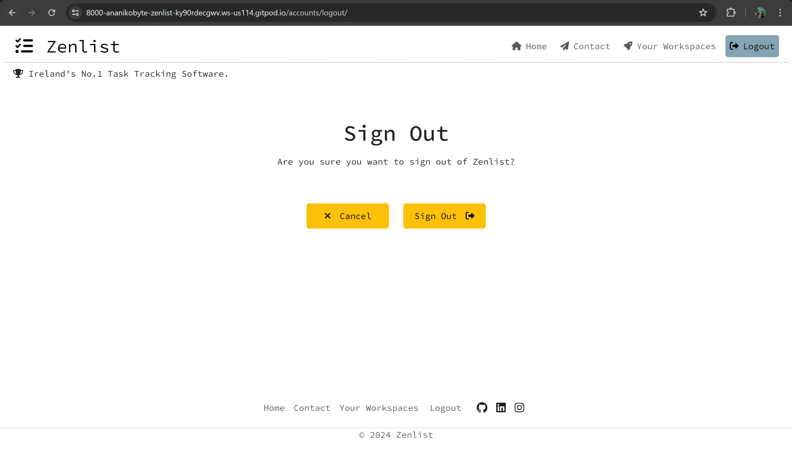

# A Bit About Zenlist
The application is available for viewing [here](https://zenlist-b604919b54d1.herokuapp.com/).

The application was tested on an ASUS Zenbook, iOS Apple iPhone 11 Pro, and on an Android Google Pixel 6 Pro.

## Introduction
Zenlist is a task-tracking Django application, designed to provide users with an easy and quick way of organising and managing day-to-day tasks for different environments. With accessible sorting systems and an intuitive interface, Zenlist is the perfect go-to for anyone who wishes to improve their time-management skills and stay on top of their day.

## Business/Social Goals
- Allow for easy and intuitive organisation of assets in user-created environments. These environments should have sorting functionality to make the platform easily accessible and understandable.

- Design the platform to be accessible for all ages (or minimum for those over 12 years).

- Set up a visual alert for tasks approaching the due date. 

- Set up an email alert for registration and account authentication.

- Spread knowledge of the Scrum framework and explain how this framework benefits workplaces and personal time management. Add links to relevant media and open-source documents. 

## UX Goals
- Create a simple and intuitive UI for young and first-time users to foster a sense of comfort and reassurance.

- Design a simple and easy navigation system (primary navigation and breadcrumbs so the user knows where they are at all times and can backtrack when needed).

- Establish a colour scheme and font family that ties the theme of _zen_ to create cohesive and comprehensive branding with accents where needed.

- Keep the application visually minimalistic with white spacing and simple accents to maintain the _zen_ theme and branding.

## User Stories

| User Story | User Story Testing |
| ----- | ----- |
| 1a. As a site user, I want to be able to view scrum-related information on the home page. 1b. As a site user, I want to be able to easily find and access the scrum website and scrum guide. | There is a paragraph dedicated to the Scrum Framework on the home page under the reviews section, giving users a brief introduction. Additionally, a helpful link is provided to the official Scrum.org website where interested users may download the Scrum Guide free of charge. |
| 2. As a site visitor, I want to be able to easily send a message to the site owner. | There is a dedicated Contact page with a form for users to contact the Zenlist team. This message gets sent to my email and the sender's email is attached in the reply_to method. Additionally, adhering to good UX practice, users get instant confirmation on whether their message was sent through Django's success messages. Automated testing for this form can be found under scrum/test_forms.py, or under the '_Automated Testing_' section below. |
| 3a. As a user, I want the ability to register for a Zenlist account. 3b. As a user, I want the ability to easily access a login/signup form. | Users require an account to access most of Zenlist's functionality. Unregistered users have access to the Zenlist Scrum page, Reviews page and Contact page. However, users must be signed in in order to leave a review, view any pending reviews, and access their workspaces. To signup/signin, users can access the page directly in the navigation/footer, or use one of two buttons available on the Scrum page for signing-up. All buttons take users into either the sign-up or sign-in pages. After completing and submitting the forms, users are requested to confirm their email address from a link sent to their emails. This link takes them into a Zenlist confirmation page where they confirm, and asks them to sign in post registration. Links in the navigation and footer accomplish the same. After signing in, users are redirected to the home page, where the jumbotron displays a greeting and the function of the first button changes to a workspace redirect. The review form is now visible, as well as the '_Your Workspaces_' tab in the navigation and footer bars. The signup/signin/signout links in the navigation and footer bars is visible based on the registree's condition, i.e., if the user is signed in, only the '_Sign Out_' link of the three displays. |
| 4. As a registered user, I want the ability to create a new workspace. | Workspaces can be created through the '_Add Workspace_' button, visible on the '_Your Workspaces_' tab. A modal pops up with a prompt to enter a workspace title, and a note stating that the titles must be unique. After submitting a title, a confirmation message pops up and the workspace is appended to the list. If the user enters a name that already exists in their list, the application will throw a 500 page. A home button is avaiable on this page and redircts users back. |
| 5. As a registered user, I want the ability to view my existing workspaces and click on them to see any existing tasks in that workspace. | In '_Your Workspaces_', users may view all of their existing workspaces. If there are none, a different page displays with an image and a button to add workspaces. |
| 6. As a registered user, I want the ability to move tasks between Statuses. | Tasks are visible in the respective columns based on their current status. To change the status of a task, the user needs to edit the task. After the change has been submitted, the tasks moves to its new respective status column. |
| 7. As a registered user, I want the ability to create a task. | A form for task creation is available inside each workspace for users to create tasks. Once the information is submitted, a message pops up informing the user whether their task was added successfully or if an error occurred |
| 8. As a registered user, I want the ability to edit my tasks. | Each task, once expanded, shows an edit button. After clicking, the task information displays in the task form, with the form changing colour to indicate a change in functionality. After submitting the change, the task gets updated accordingly. |
| 9. As a registered user, I want the ability to manage my tasks, including deleting them from my workspace. | Each task, once expanded, shows a delete button. After clicking, a modal pops up asking the user for confirmation that they wish to delete this task. A note in the modal informs the user that this is irreversible. If the user confirms, the task is deleted. If they cancel, they get redirected back inside the workspace and no change occurs. |
| 10. As a registered user, I want the abiity to manage my workspaces, including the ability to delete them. | Each workspace is appended with a delete button. After clicking, a modal pops up asking the user for confirmation that they wish to delete this workspace, with a title displayed for context. A note in the modal informs the user that this is irreversible. If the user confirms, the workspace is deleted. If they cancel, they get redirected back to the '_Your Workspaces_' tab. |
| 11. As a registered user, I want the ability to logout without losing my changes. | Users may log out by accessing the '_Sign Out_' button in either the navigation or footer bar. This link takes them to a sign out page where the user confirms whether they wish to sign out. Regardless of confirmation or decline, they get redirected to the home page. If the user signs out, a message informing them of having done so pops up. The jumbotron offers confirmation via greeting and button. |
| 12. As a non-registered user, I would like to view reviews about Zenlist. | Reviews are available for viewing on the main home page, and on a standalone reviews page. A button under the filtered 5 star reviews takes users to this page. Sorting functionality has been incorporated to allow users to quickly access the type of reviews they are looking for. Additionally, registered users can view any pending reviews. |

## Wireframes

_Note: The application has deviated slightly since the wireframe was created, due to either UIUX decisions or the need for additional functionality. Most notable, is in the Scrum/Home page._

## Strategy
This application aims at optimising task and time management by leveraging the benefits of an intuitive and minimalist UI, visual reminders of approaching task due dates, and sorting systems for efficiency.

The application is designed as a desktop-first app due to today's desktop-based work, study, and entertainment. However, consideration has been thoroughly given to the feel of the website on mobile, and responsiveness is adopted throughout the application.

## Target Audience
- Users over 12 years of age. 
- Hobbyists.
- Students.
- Anybody who wishes to improve their time-management skills. 

## Key Information Deliverables
- Categorisation of tasks by environment.
- Time-tracking capabilities with visual reminders for approaching tasks.
- Sorting system (by space, by priority, by due date) for tasks, and by best, by lowest, by recent for reviews.
- Ability to add/view/edit/delete assets. 

## Features
- Jumbotron

At the top of the Zenlist home page, the user is greeted with a large eye-catching jumbotron. This feature serves as a marketing element, as well as a visual indication of whether the user is logged in (although this only becomes apparent and habitual to experienced users). 

Signed out user jumbotron - 

Here, the user is presented with a button for signing in, as they will need an account with Zenlist to create and access their workspaces and tasks.

Logged in user jumbotron - 

Here, the user is presented with a button that redirects them to their workspaces, as well as a greeting with their user name. 

- Reviews

Reviews can be found in two places - on the main home page (where they are filtered by 5-star reviews only), as well as on a dedicated reviews page where they can be accessed through the '_Read all Reviews_' button on the home page. 

Reviews on the main reviews page have additional sorting functionality, where the user can easily and quickly access the type of reviews they are looking for. They can be sorted: 
 - '_by best_'
 - '_by lowest_'
 - '_by recent_'

As well as this, if the user is logged in and has pending reviews for approval, their reviews can be seen under the _Your Reviews Awaiting Approval_ section, under the existing. If there are no pending reviews or if the user has not left any reviews, this section is hidden. Any reviews pending approval can be deleted, but once they are approved, the user must contact the admin to get them deleted. If the user wants to delete the review, a modal will pop up asking for confirmation before deleting the review.

To leave a review, the user must be signed in. More information on this is available in the _Review Form_ and _Sign In_ sections below.

Note: In the images below, all reviews are placeholders and come from the same account, therefore they will likely differ from those found in the end product.

Home page reviews - 

Reviews page reviews - 

Reviews page reviews pending approval - 

Review delete confirmation modal -

- Review Form

To submit a review, the user must be signed in. On the home page, the user can find a '_Share your Thoughts_' section. If the user is not logged in, a _Sign Up_ button displays with a sentence prompting the user to sign in to leave a review.

If the user is signed in, the review form will display and they can submit a review for approval. After submission, they will be taken back to the top of the home page and a Django message will pop up letting them know that their review should be reviewed within the next 2 days by a Zenlist admin. If the review cannot be submitted, an error message will pop up letting them know that the submission was unsuccessful.

The submitted review will be available for viewing on the main reviews page, under the _Your Reviews Awaiting Approval_ section.

- Scrum

The Scrum framework is a core principle of the Zenlist application. While its functionality is limited, it embodies some of the core aspects of time management and organisation in its zenlist structure (and is quite similar to the Jira time tracker). 

The application's home page contains a paragraph with useful information on getting started with Scrum, and a link to visit the official Scrum.org website, where interested users may download the Official Scrum Guide 2020 (latest version), free of charge. 

This paragraph is designed as a Django model to facilitate reusal and to accommodate any future expansion ideas in terms of content and formatting.

Scrum paragraph -

Scrum link to Scrum.Org - 

- Sign In

As the user requires an account to access most of Zenlist's features, the application includes sign-in, sign-up, and sign-out pages. The sign-in/sign-up page may ask users to confirm their email addresses through a link forwarded to the emails they registered their account with. Each of these will then redirect to the home page. 

The user may find the page for signing in either at the top of the page in the navigation bar or at the bottom in the footer. This page is only displayed if the user is not signed in.

Sign In Page -

- Sign Up

The user may find the page for signing up either at the top of the page in the navigation bar or at the bottom in the footer. This page is only displayed if the user is not signed in.

Sign Up Page -

- Sign Out

The user may find the page for signing out either at the top of the page in the navigation bar or at the bottom in the footer. This page is only displayed if the user is signed in.

Sign Out Page -

After signing out, the user is redirected to the home page where they can find visual indication of them having signed out, i.e., a Django message and a change in the jumbotron button and wording.

Signed Out Message -

- Contact Page

Zenlist contains a dedicated '_Contact_' page for users to send questions/queries to the Zenlist team. This page can be accessed either from the main navigation bar at the top of the page, or in the footer navigation at the bottom of the page.

This form contains validation, and correctly-formatted messages that have been submitted will be sent to the Zenlist team via email. After submission, the user is redirected to the home page with a confirmation message letting them know that their message has been sent and should recieve a reply within 2 business days. 

The message shows up on email (my email) as '_New Message from ***_', and has a reply_to plug to reply to the email address from which the message was sent. 
The message shows up on email (my email) as '_New Message from ***_', and has a reply_to plug to reply to the email address from which the message was sent. 

Contact Page -

Email Sent Confirmation Message - 

Message in Email - 

- Your Workspaces

Once the user registers an account, they will get access to the '_Your Workspaces tab_' in the navigation bar and footer. This tab will take them to a dedicated page where they may view all of their environments (workspaces) and tasks. If there are no workspaces, the user will see a different design with a button to create their first workspace. 

Additionally, this tab can be accessed from the home page jumbotron, which displays a '_My Workspaces_' button.

Page with Workspaces - 

Here the user gets access to a list of their workspaces (links, which take them inside the workspace after the user clicks on the one they wish to visit), as well as a column with a list of tasks that are due on today's date. If no tasks are due, a congratulatory message displays.

If the user chooses to delete a workspace, this will delete all of the tasks in that workspace, as well as the workspace itself from the database, and it will no longer be visible in the list. Before performing the delete, the user will get a confirmation modal asking them to confirm the deletion.

Delete workspace Modal - 

No Workspace in list post Delete -

If the user has no workspaces, a different page displays.

Page without Workspaces - 

_Note: The 'Add Workspace' buttons work the same on both pages, and display a modal prompting the user to enter a title for the workspace they wish to create. This workspace gets immediately appended to the list for the user to access._

Add Workspace Modal -

- Tasks

To access an environment's tasks, the user needs to click on one of their workspaces to be taken inside a dedicated view. This view is inaccessible from everywhere else.

A breadcrumb displays under the main navigation bar, informing users of their current location, with relevant links to go back up the navigation hierarchy.

Tasks have several attributes, such as their name, their status, their priority, and their due date, each of which helps to either visual sort them (priority is indicated by a coloured dot beside the name of the task), or to sort by selection (by due date and by priority). 

Inside Workspace: '_Boston_'

Currently there are no tasks in this environment, but they can be added using the task form on the left hand side of the page. Added tasks can be sorted by due date (nearest date at the top) or by priority (most important at the top). 

Adding a Task -

Calender Widget on Task - 

To access the task's information, the user needs to click on it to expand the accordion body, as shown in the image below.

Task Accordion -

After submitting the task, it will show up in the relevant status column. If the user wishes to edit the task, they need to expand the accordion body (by clicking on the task they want to update), and clicking the '_Edit Task_' button. This will engage the task form with that specific task's information, and allow the user to make changes to it before re-submitting the task. The form will change colour to indicate a change of functionality. 

Edit a Task -

Submit Updated Task - 

If a user wishes to delete a task, they get the same confirmation modal pop up as in the review and workspace section, asking for confirmation before deleting. Once confirmed, the task deletes and redirects the user back to the open workspace.

Deleting a Task - 

## Structure 

- Home Page
    - Jumbotron 
        - Signed-Out User: 
            - Marketing sentence.
            - '_Sign Up_' Button.
            - 'P.S. It's free ;)'
        - Signed-In User:
            - Motivational sentence.
            - '_My Workspaces_' Button.
    - Reviews Row
        - 5-star reviews.
        - '_Read all Reviews_' Button.
            _Note: Takes the user to a standalone reviews page that cannot be found anywhere in the navigation bar or footer._
    - Scrum Paragaraph
        - Scrum.org website link.
    - Share Your Thoughts (reviewform)
        - Signed-Out User: 
            - '_Sign In_' Button.
        - Signed-In User:
            - Review Form.
            - '_Submit_' Button.
- Reviews Page
    - Heading
    - Sort by selection
        - '_by best_'
        - '_by lowest_'
        - '_by recent_'
    - Reviews
    - Signed-In User:
            - If the user has pending reviews, they may be viewed here in a faded colour.
            - Each review has a delete button.
                - Confirmation modal.
- Contact Page
    - Heading
    - Contact Form
    - '_Send Message_' Button
        - Message gets sent to email.

_If the user is signed out:_

- Sign In/ Sign Up Pages
    - Relevant fields for signing-in/signing-up.
    - Email authentication (email + standalone page).

_If the user is signed in:_

- Your Workspaces
    - '_Due Today_' Column.
    - List of user's workspaces. 
        - -> On click, takes user into dedicated detail view.
            - Task Form
            - Sort by selection
                - '_priority_'
                - '_by due date_'
            - Status columns with tasks.
                - Each task has an '_Edit Task_' Button.
                - Each task has a '_Delete Task_' Button.
                    - Confirmation modal.
        - '_Delete Workspace_' Button.
            - Confirmation modal.
    - '_Add Workspace_' Button.
    - Sign Out
        - Are you sure you want to Sign Out?

## Models
Below is a simple ERD for Zenlist's models. Its two applications, _Scrum_ and _Workspace_ consist of several One-To-Many database tables. Provided is a brief overview, with an explanation under the image.

#### Scrum App
Models: Scrum + Review

- #### The Scrum Model

The scrum model contains all relevant information regarding the Scrum paragraph on the main homepage. While it was valid to add this content directly into the HTML, a model format allows admins to have user-friendly access for maintaining and updating content based on website needs. 

The '_id_' field in the model is automatically provided by Django (and could potentially come into use if the model were to be recycled throughout the application). 

The '_title_' field refers to the title of the Scrum paragraph. 

The '_updated_on_' field is read-only and is used mostly for reference whenever the scrum model is modified. 

The '_content_' field is a textField that utilises Summernote for efficient and manageable content-editing. 

- #### The Review Model

The '_id_' field in the model is automatically provided by Django and comes into play in views that need to access specific reviews for editing/deletion.

The '_author_' field refers to the _Django User_ model in a One-To-Many relationship, referencing the user to whom the review belongs.

The '_job_industry_' field is a selection field for selecting the industry in which the reviewer works. This is used purely for contextual purposes and as a means of demonstrating that the application can be used by all, regardless of their professional background. 

The '_rating_' field is a selection field for selecting the star rating the reviewer wishes to give to the appliation during the review process.

The '_review_' field is a TextField (max 120 characters), where the user can comment on the application. 

The '_reviewed-on_' field is a read-only date field refering to the date the review was left on (regardless of when it was approved).

The '_approved_' field is a boolean field indicating whether the review has been approved by a Zenlist admin. 

---

### Workspace App
Models: Workpace + Task

- #### The Workspace Model

The '_id_' field in the model is automatically provided by Django and comes into play in views that need to access a specific workspace for deletion.

The '_title_' field is a modifiable character field referring to the title of the workspace. 

The '_slug_' field contains a slugified '_title_' value, which is used in the creation of unique URLs for each workspace.

The '_creator_' field is a One-To-Many relationship database table referring to the Django User model, and references the currently logged in user and their ownership of a specific workspace. This field is used for filtering and displaying only the relevant workspaces to each user.

The '_created_on_' field is a read-only date field refering to the date the workspace was created on.

The '_updated_on_' field is a read-only date field refering to the date the workspace was modified on.

- #### The Task Model

The '_id_' field in the model is automatically provided by Django and comes into play in views that need to access specific tasks in each workspace for editing/deletion.

The '_name_' field is a modifiable character field, referring to the name of the task assigned by the user during task creation using the _TaskForm_. 

The '_notes_' field is a modifiable text field with a max length of 100 characters, used for adding notes/comments under each task.

The '_creator_' field is a One-To-Many relationship database table referring to the Django User model, and references the currently logged in user and their ownership of a specific task.

The '_workspace_' field is a One-To-Many relationship database table referring to the '_Workspace_' model, and references the workspace to which the task belongs.

The '_status_' field is a modifiable selection field for selecting one of three avaiable statuses to filter tasks by _To Do_, _In Progress_, and _Completed_.

The '_priority_' field is a modifiable selection field for selecting one of four avaiable priorities to filter tasks by their priority, i.e., by _Critical_, _Major_, _Minor_, and _Nice to have!_.

The '_due_date_' field is a modifiable datetime field used for specifying the task's due date.

The '_date_created_' field is a read-only date field refering to the date the task was created on.

The '_last_modified_' field is a read-only date field refering to the date the task was modified on.

## Views & Templates
_Note: All pages contain the same navigation and footer sections._

### Scrum Home Page
---

The Scrum page deep-dives into Scrum methodology and provides potential users with information on the app. It also contains an attention-grabbing header, reviews, an introduction to the scrum methodology for time management, and the option for users to leave a review if they have a registered account and are currently signed in. 

- Jumbotron

    - The jumbotron displays a signup button if the user is not signed in.
    - The jumbotron displays a button to access the user's workspaces if the user is signed in. Additionally, a greeting displays with the user's username as an indication and confirmation that the user is signed in.

- Reviews

 - The reviews on the Scrum page are filtered by stars (5) and displayed in a row to site visitors. A button under the reviews section takes users to a standalone reviews page with sorting functionality. This page can only be accessed from this button, but users can return to a page of their choosing by selecting existing links in the navigation/footer bar. 

Only signed-in users can submit reviews, and all reviews require approval from an administrator before being displayed on the home/reviews page.

 The reviews page incorporates sorting functionality (by best, by lowest, by recent), so users have fast access to the exact reviews they are looking for and users can view any of their reviews pending administrator approval. 

- Scrum Paragraph

 - A concise paragraph explaining the scrum methodology and its benefits in everyday use. This paragraph serves as an introduction to the framework for anyone not already familiar with it and contains a helpful link to the official Scrum.org website, where users may download the free Scrum Guide 2020 (the latest revision). 

- Review Form

 - If users are signed in, the review form displays and users may submit their review to administrators.

 - If users are signed out, a sign-in button displays with a prompt to log in to leave a review. The form displays after the user signs in.

### Contact 
---
This is a contact page for users to send queries to the Zenlist team (connected to my email).

### Your Workspaces
---
_Note: This page is only visible in the navigation/footer bar to signed in users._

This is a list of workspaces belonging to the user. This page also contains a '_Due Today_' column with lists of tasks that are due in each workspace. If there are no due tasks, a congratulatory message is displayed to the user. 

- Workspace List 

Each workspace box displays the following information:
 - Workspace Name
 - Total number of tasks in workspace.
 - '_Delete Workspace_' Button

 - On click, users are taken into a detailed view of their workspace, where they have access to a task form (for adding new tasks), and an overview of all tasks in their status columns - '_To Do_', '_In Progress_', '_Completed_'. Additionally, on clicking on one of these tasks, the task's notes and due date become visible, along with buttons for editing (the task appears in the task form with a different background colour), and deleting the task (through a confirmation modal). A circle beside the name of the task indicates its priority, as follows: 

 - red circle - '_Critical_' 

 - orange circle - '_Major_' 

 - yellow circle - '_Minor_' 

 - green circle - '_Nice to have!_' 

- Due Today List

 - Number of tasks in each space due on a particular day.

- Add Workspace Button

 - Modal with title field input.

 - Messages to tell the user the workspace was successfully created.

### Sign in/Sign Up
---
A page where the user may signup/signin, using allauth Django.
_Note: These pages are only displayed when the user is not signed in._

- An email authentication prompt for users who have just signed up.

- Visual indication that the user is signed in (jumbotron + '_Your Workspaces_- tab in navigation bar).

### Sign Out
---
A page where the user may logout, using allauth Django.
_Note: This is only displayed when the user is signed in._

- Visual indication that the user has signed out (jumbotron + no '_Your Workspaces_' tab in navigation bar).

## Scope of Application
The application encompasses the following scope: 

- User Interaction

Once registered and signed in, the user can access their Zenlist environments in the '_Your Workspaces_' tab. All tasks ('_To Do_', '_In Progress_', and '_Completed_') are visible in their respective status columns. After selecting and entering a workspace, the user can add another task to the list via the form on the left-hand side. Here, they need to give a title, assign a category, a due date, a priority, and a brief can add a brief description (no more than 100 characters) of the task they wish to add. Once the task is submitted, the user may:
 - Open the task accordion (by clicking on it) to view the task details (due date, priority (colourful dot), and any associated notes).

 - Edit the task (using the form on the left-hand side of the page). The form will take on a different background colour to indicate a change in its behaviour. 

 - Change the task's status, in which case the user receives a confirmation message following a successful update and visual confirmation that the task has switched to the relevant status list.

 - Delete the task. In this case, a confirmation modal pops up before deleting the task.

 - Sort the '_To Do_', '_In Progress_', and '_Completed_' columns either by priority (from '_Critical_' at the top to '_Nice to have!_') or by due date (approaching dates at the top).

- Environment Categorisation

The purpose of Zenlist is to allow users to categorise their day into environments. Each Zenlist environment, i.e., home chores, study-related tasks, etc., keeps tasks separate and provides users with the clarity and comfort of organising their day. Each space presents tasks due on a particular day under the '_Due Today_' column on the main '_Your Workspaces_' tab.

- Sorting System

A simple sorting system allows users to easily sort their tasks based on their preferences. Tasks can be sorted: 

 - '_by priority_'
 - '_by due date_'

- Scrum & Agile Knowledge Sharing

To help users understand the Zenlist framework, the application home page has been adapted as a Scrum Introduction page, with a basic overview of the practical uses and applications of Scrum to a team and personal context. Furthermore, a provided link takes interested users to the official [Scrum.org](https://scrumguides.org/index.html) website, where they may download the official Scrum manual 2020 (latest version) free of charge.

## Aesthetics
The Zenlist theme aims to improve UIUX by leveraging a minimalist theme, with icons and accent colours where necessary. The colour scheme utilises natural dark brown, grey, and blue hues to give the application a strong 'grounding' theme. Accent colours persist in the bright yellow and red - yellow for stand-out functionality such as editing or button redirection and red for deletion of elements. 

Furthermore, accents are applied on tasks in the form of '_priority_' circles, giving users a visual indication of a task's priority by leveraging colours. For example, a dark red circle indicates a '_Critical_' status, while a muted blue indicates a '_Nice to have!_'. The colour scheme for this resembles a sunset.

Task Colour Scheme - 

## Technologies
1. HTML5/ Django Templates - Used for structuring and content.
2. CSS3 - Used for adding styles to the content for legibility and aesthetic appeal.
3. Vanilla Javascript - For adding basic interactivity and dynamically setting URLs.
4. FontAwesome/Bootstrap icons - used for icons.
4. FontAwesome/Bootstrap icons - used for icons.
5. Emojipedia - used for emojis.
6. Firefox Developer Tools - used for debugging the website during production.
7. Lighthouse - An extension I used for testing the performance, accessibility, best practices and SEO of my site (result shown under debugging below).
8. GitHub - For code storage, version control and deployment.
9. Git - For commiting through the terminal and pushing to GitHub for storage.
8. GitHub - For code storage, version control and deployment.
9. Git - For commiting through the terminal and pushing to GitHub for storage.
10. VSC - The IDE I developed the project in.
11. Balsamiq - For a clear understanding of the structure I wanted my application to follow. The project has since deviated slightly from the design for improved user experience.
12. Color Contrast Accessibility Validator - check legibility of my text on different backgrounds for better accessibility.
13. W3C Markup Validation Service - to validate my HTML for potential errors.
14. W3C CSS Validation Service - to validate my CSS code for potential errors.
15. JSHint - for checking and validating my JS code. 
16. Pep8 - for Python code validation and best practices formatting.
17. Freeformatter CSS Beautify - to ensure I formatted my CSS correctly.
18. Beautifier.io - to beautify my JS. 
19. BeFunky Collage Maker - to create the responsive image.

## Testing & Debugging
This section outlines procedures for manual testing. For automated testing, please see all files '_test*.py_'.

- ## Manual Testing

- ### Home/Scrum Page
| Feature | Expected Outcome | Testing Procedure | Result | Remark |
|---|---|---|---|---|
| Jumbotron display | If the user is not logged in, the banner should display a signup button and signup motivation, else a hello, {user} and a workspaces button | Signout + visual check, sign-in + visual check | Displays as expected. |  |
| Reviews | Only displays approved 5-star reviews | Add new 5-star review, do not approve - check it does not display. Approve review, check it displays. | Displays as expected. |  |
| Scrum Section | Image + Text Display as per styling | Visual Check + Lighthouse Image Paint test | Displays as expected. |  |
| Review Form | If the user is not logged in, do not display review form but display button to sign in, else display review form | Signout + visual check, sign-in + visual check | Displays as expected. |  |

---

- ### Reviews Page
| Feature | Expected Outcome | Testing Procedure | Result | Remark |
|---|---|---|---|---|
| Read all Reviews Button | Displays? Takes to the correct page? | Visual check + click | Behaves as intended |  |
| Reviews | Do all reviews display? | Visual check + database check | All display as intended |  |
| Sorting | Do reviews sort as intended based on selection? | Manual test + check datasets in Chrome Developer Tools | Behaves as intended |  |
| User Reviews | If the user is logged in and has pending reviews, do they display in grey? | Sign in, manually add review through the form on the home page + check | Behaves as intended. |  |
| Delete User Reviews | If the user is logged in and has pending reviews, can they delete them? Confirmation modal pops up? | Delete a single user review from the reviews page | Behaves as intended. |  |

---

- ### Contact Page
| Feature | Expected Outcome | Testing Procedure | Result | Remark |
|---|---|---|---|---|
| Form Display | Form displays? | Visual check, both signed in and signed out | Displays as expected. |  |
| Field Validation | Empty/wrong format fields == invalid form? | Leave fields empty one by one, enter invalid email format + submit each time, finally input correct formats + submit | Submits when fields are valid only. |  |
| Send to Email | Does the user's message get sent to ananikolayenia@gmail.com? Is the user email in the reply to field in the mail? | Test message + check email. | Functions as expected, reply gets sent to user email. |  |

---

- ### SignUp
| Feature | Expected Outcome | Testing Procedure | Result | Remark |
|---|---|---|---|---|
| Nav Display | Link displays only to signed-out users? | Visual check | Displays as expected. |  |
| Form Display | Form displays? | Visual check | Displays as expected. |  |
| Field Validation | Empty/wrong format fields == invalid form? | Leave fields empty one by one, enter invalid email format + submit each time, finally input correct formats + submit | Submits when fields are valid only. |  |
| Email Confirmation | Receive Email Confirmation? Button to Accept? | Check Email | Received. |  |
| Redirect to SignIn | After accepting, redirects to the sign-in page? | Click + Visual check | Behaves as expected. |  |

---

- ### SignIn
| Feature | Expected Outcome | Testing Procedure | Result | Remark |
|---|---|---|---|---|
| Nav Display | Link displays only to signed-out users? | Visual check | Displays as expected. |  |
| Form Display | Form displays? | Visual check | Displays as expected. |  |
| Field Validation | Empty/wrong format fields == invalid form? | Leave fields empty one by one, enter invalid email format + submit each time, finally input correct formats + submit | Submits when fields are valid only. |  |
| Success Message on Login | Displays Success Message? Jumbo Wording Change? | Sign-in + Visual Check | Wording changes and success message displays as expected. |  |

---

- ### Your Workspaces
| Feature | Expected Outcome | Testing Procedure | Result | Remark |
|---|---|---|---|---|
| Due Today Column | Displays workspace names with tasks due today? Congratulatory message if no due tasks? | Visual check for today's tasks + if no tasks due today, check for message and add a task due today. | Displays as intended. |  |
| Workspaces List | Displays list of user workspaces? If no spaces, display llamas with a button to add a workspace? | Visual check + delete existing workspaces + add workspace on llama page | Behaves as intended. |  |
| Add Workspace Button | Displays modal with the form? Adds workspace to list? Success Message? | Add workspace + check | Behaves as intended. |  |
| Delete Workspace Button | Displays confirmation modal? Displays correct workspace name? Deleted workspace from list and database? | Delete a workspace + visual check | Behaves as intended. |  |

---

- ### Inside Workspace
| Feature | Expected Outcome | Testing Procedure | Result | Remark |
|---|---|---|---|---|
| Task Form | Task Form displays? Add Task Successfully? | Add Task Manually | Behaves as intended. |  |
| Status Columns | Display task counts? Display all tasks? Do task accordions work as intended? | Visual check + click on tasks | Behave as intended. |  |
| Edit Task | Edit button displayed in accordion? On click, displays all task information correctly in form? After submitting, updates the task in status column? | Manual test | Behaves as expected except that the date gets added back to the form a day later than the due date |  |
| Delete Task | Confirmation modal pops up? After confirmation, deleted task? On cancel, returns to full workspace detail view? | Manual check +  visual check | Behaves as intended. |  |

---

- ### Sign Out
| Feature | Expected Outcome | Testing Procedure | Result | Remark |
|---|---|---|---|---|
| Nav Display | Link displays only to signed-in users? | Visual check | Displays as expected. |  |
| Button Display | Buttons display? | Visual check | Display as expected. |  |
| Cancel Button | Returns to Home page and leaves user signed in? | Click 'cancel' + check if user still has access to workspaces + correct navigation links | Functions as intended. |  |
| SignOut Button | Sigs User out returns to Home page? Changes Banner Wording? | Click 'SignOut' + check navigation link display, banner, and success message | Functions as intended. |  |

---

- ## Automated Testing

Tests are compiled in files with the following naming convention: '_test_*.py_'. This section is broken down by app, with a brief overview of testing procedures.

### Scrum App
- test_forms.py

 Contains a class for testing the contact form associated with the Scrum model form and if specific user inputs are correctly placed in the form fields.

 Methods: 

 '_test_name_required()_':
 This test verifies that a populated contact form which is missing a name input is not submitted and that the error stems from the missing name field input.

 '_test_email_required()_':
 This test verifies that a populated contact form which is missing an email input is not submitted and that the error stems from the missing email field input.

 '_test_email_correct_format()_':
 This test verifies that a completed populated contact form is not submitted unless the email adheres to the expected email format and that the error stems from the incorrectly filled email field.

 '_test_message_required()_':
 This test verifies that a populated contact form which is missing a message input is not submitted and that the error stems from the missing message field input.

 '_test_message_max_length_200_char()_':
 This test verifies that a completed populated contact form is not submitted unless the message input is less than 200 characters and that the error stems from the overfilled message field.

 Note: The application form on the user side does not allow the insertion of more than 200 characters.

 '_test_form_is_valid()_':
 This test verifies that a correctly filled-out contact form is successfully submitted.

- test_models.py

 Contains a class to test all models associated with the Scrum app.

 Methods: 

 '_def setUp()_':
 Simulates the logging in of a user for review model assertion, and creates instances for the Scrum and Review models.

 '_def test_scrum_model_creation()_':
 Runs a series of assertions for each Scrum Model field to validate the expected values of the instance.

 '_def test_review_model_creation()_':
 Runs a series of assertions for each Review Model field to validate the expected values of the instance.

 '_def test_user_deletion_cascade()_':
 Deletes the currently logged-in user and checks whether the user's reviews were deleted as well, as per cascade.

- test_urls.py

 Contains a class for testing URLs associated with Scrum Views.

 Methods: 

 '_def test_hello_resolves()_':
 Reverses the URL name and checks if it returns the correct FBV of HelloScrum.
 Asserts HelloScrum is resolved from 'hello'.

 '_def test_contact_resolves()_':
 Reverses the URL name and checks if it returns the correct FBV of Contact_Me.
 Asserts Contact_Me is resolved from 'contact'.

 '_def test_reviews_resolves():_'
 Reverses the URL name and checks if it returns the correct FBV of Zenlist_Reviews.
 Asserts Zenlist_Reviews is resolved from 'reviews'.

---

### Workspace App
- test_forms.py

 Contains two classes. The first is a class for testing the workspace form associated with the Workspace Model. This form creates a new workspace instance if specific user inputs are correctly placed in the form fields.

 Methods: 

 '_def test_title_is_required()_':
 This test verifies that a populated workspace form which is missing a title input is not submitted and that the error stems from the missing title field input.

 '_def test_form_is_valid()_':
 This test verifies that a correctly filled-out workspace form is successfully submitted.

- test_models.py

 Contains a class to test all models associated with the Workspace app.

 Methods: 

 '_def setUp()_':
 Simulates user log-in to allow the creation of workspaces and tasks.
 Simulates the creation of a workspace where workspace.creator field is automatically assigned the current User instance.
 Simulates the creation of a task where task.creator is automatically assigned the current User instance, and task.workspace is automatically assigned the current workspace.

 '_def test_workspace_model_creation()_':
 Runs a series of assertions for each Workspace Model field to validate the expected values of the instance.

 '_def test_task_model_creation()_':
 Runs a series of assertions for each Task Model field to validate the expected values of the instance.

 '_def test_workspace_delete_when_user_delete()_':
 Deletes the user and checks whether workspaces and tasks associated with the user were deleted as well, as per cascade.

 '_def test_task_delete_when_workspace_delete()_':
 Deletes the current workspace and checks whether tasks associated with the workspace were deleted as well, as per cascade.

- test_urls.py

 Contains a class for testing URLs associated with Workspace Views.

 Methods:

 '_def test_workspace_list_resolves()_':
 Reverses the URL name and checks if it returns the correct CBV of WorkspaceListView.
 Asserts WorkspaceListView is resolved from 'spaces'.

 '_def test_workspace_detail_resolves()_':
 Reverses the URL name with arguments [slug] and checks if it returns the correct FBV of workspace_detail.
 Asserts workspace_detail is resolved from 'full_workspace'.

 '_def test_workspace_delete_resolves()_':
 Reverses the URL name with arguments [int:id] and checks if it returns the correct FBV of delete_ws.
 Asserts delete_ws is resolved from 'delete_workspace'.

 '_def test_task_edit_resolves()_':
 Reverses the URL name with arguments [slug, int:id] and checks if it returns the correct FBV of update_ws_task.
 Asserts update_ws_task is resolved from 'task_edit'.

 '_def test_task_delete_resolves()_':
 Reverses the URL name with arguments [slug, int:id] and checks if it returns the correct FBV of delete_ws_task.
 Asserts delete_ws_task is resolved from 'task_delete'.
 
## Accessibility & Performance
The application takes care in ensuring good UIUX and legibility practices as well as accessibility for screen readers. 

Forms are protected from CSRF attacks by tokens tied to the user's session. Before any information is submitted, form fields are validated for empty values and incorrectly formatted input. 

Additionally, Django messages inform users whether their request was successful. If an error occurs, they are encouraged to contact the Zenlist team with their query using the dedicated contact form on the '_Contact_' page. 

### Lighthouse

Below is a report from the [Lighthouse - Chrome for Developers](https://developer.chrome.com/docs/lighthouse/overview), dated 17/06/2024.

As can be seen from the report, the application performs well in '_Accessibility_', '_Best Practices_', and '_SEO_', but experiences some delay in the '_Performace_' meter. 

Some aspects slowing down the application include: 

- _largest Contentful Paint_ (The Jumbotron Image). 

The image, initially downloaded from [Unsplash](https://unsplash.com/photos/man-on-rope-fCzSfVIQlVY) weighing 17GB, was compressed several times using services like [TinyPNG](https://tinypng.com/), [iloveIMG](https://www.iloveimg.com/compress-image), and [Image Compressor](https://imageresizer.com/image-compressor), reaching a final weight of 710KB (99.996% compression). Any more compression after this figure interferes with the colour display on the image. While simply changing the image to one that weighs less was considered, it was decided to keep the original due to its aesthetic, and message of 'balance', which compliments the Zen theme of the application. 

Additional Considerations: 

### Colour Accessibility Validator 
Upon running the application through the [a11y Colour Checker](https://color.a11y.com/) via the URL input, the service displayed no issues. 

### HTML Validation
On running the application through the [W3C Markup Validation Service](https://validator.w3.org/) via the URL input, the service highlighted two errors, as shown below. 

_Note: The second error shown above resulted from Summernote's rendering of the Scrum Content text. This was rectified by changing my own HTML 'p' element to a 'div' so that the paragraph would be rendered inside the div and not crop up as an error._

Homepage - 

Contact - 

Reviews -

Sign Up - 

Sign In -

Sign Out - 

Your Workspaces - 

Inside a Workspace - 

### CSS Validation
Upon running the application through the [W3C CSS Validation Service](https://jigsaw.w3.org/css-validator/) via the URL input, the service highlighted no errors, as shown below. 

### JSHint Validation
Each of the application's JS files was run through the [JSHint](https://jshint.com/) separately, to ensure the code was up to standard and functioned as expected. 

Below are the results of the js files' validation. 

common.js - 

reviews.js -

#### Warning Explanation: 
This error is directed at the bootstrap modal being initiated within the button listener. Explanation...

tasks.js - 

workspaces.js -

# Deployment
The application is deployed on Heroku through Git Hub and is available for viewing in the link at the top of this README.md document. To deploy a Heroku project, please refer to the guide below.

## Foreword
There are some general requirements when it comes to setting up your application and its files: 
- Your dependencies must be placed in the requirements.txt file.
- You must strictly adhere to the correct folder structure expected by Django's settings.
- In Django's settings.py file, setting Debug = True in development will display a detailed errors page if the application comes across an error hindering template rendering. It will also allow the collection of static files (stylesheets, images, and javascript files automatically). Setting Debug = False will display standard error pages under the same conditions and will not update with any changes to static files.

In Heroku, this is additionally configured under '_Config Vars_', as COLLECT_STATIC, with the value of 0 for blocking automatic collection, and 1 for allowing it.
- Do not commit to GitHub with Debug = True. Always set Debug = False before committing to avoid exposing personal details.

You will need a two-factor verification setup. I chose Google Authenticator because I already had it pre-installed on my phone.

### Step 1: Create an App on Heroku
Log onto your Heroku dashboard using your username and password, and confirm the access code in the two-factor verification app of your choosing.

Create a new Heroku app:

You will be asked to pick a name and region for your app before clicking '_Create app_' on the next page.

### Step 2: Connect to GitHub
Once you've created your app, go to the Deploy tab at the top.
Note: For demonstration purposes, I created a new app called '_testapp-123_'.

Select the middle box with GitHub's logo to connect your Heroku app to a GitHub Repository.

If prompted, authorize Heroku to access your GitHub account.
At the bottom, enter the name of the repository you wish to deploy to, and click Connect.

### Step 3: Automatic Deploy (Optional)
Under the "Automatic deploys" section, choose a branch from your GitHub repository that Heroku will watch for changes.

Enable automatic deploys by clicking Enable Automatic Deploys. With this, every push to the selected branch will automatically deploy a new version of your app.

### Step 4: Settings
When you create the app, you will need to add the '_heroku/python_' buildpack in the Settings tab. 

### Step 5: Deploy Your Masterpiece
If you've enabled automatic deploys, any push to the selected branch will automatically deploy your application.

If you prefer to deploy manually or want to deploy a branch without enabling automatic deploys, go to the "Manual deploy" section, select the branch, and click "Deploy Branch."

### Step 6: Where is my Application?
Your application has a similar look to the following Heroku URL: (https://*.herokuapp.com) and can be found after clicking the Open App button on your dashboard in the top right.

## Forking a GitHub Repository
To changes to your repository (or part of it) without affecting its original state, you can 'fork' it (make a copy of it). This ensures the original repository remains unchanged. To fork a GitHub repository, follow the following steps:

1. Click into the GitHub repository you want to fork.
2. Click 'Fork' in the top right-hand side of the top bar, and this should take you to a page titled 'Create a new fork'.
3. You can now work in this copy of your repository without it affecting the original.

## Cloning a GitHub Repository
Cloning a repository essentially means downloading a copy of your repository that can be worked on locally. This method allows for version control and backup of code. To clone a GitHub repository, follow the following steps:

1. Click on the GitHub repository you want to clone.
2. Press the 'Code' button. This should open a section similar to the one below.
3. Copy the link in this dropdown.

4. Open a terminal within your VSC (or whatever IDE you choose to use).
5. In the terminal type 'git clone' and paste the URL.
6. Press Enter - you now have a cloned version of your GitHub repository.

# Credits
For help with Django [queries](https://docs.djangoproject.com/en/5.0/topics/db/queries/).

For some help in setting up [email verification](https://www.codesnail.com/django-allauth-email-authentication-tutorial/) on signup.

For help understanding Django [get_queryset() and get_context_data()](https://stackoverflow.com/questions/36950416/when-to-use-get-get-queryset-get-context-data-in-django) for conditionally rendering workspaces.

For help understanding how to create a [slug from a title](https://stackoverflow.com/questions/72944678/django-how-to-create-slugs-in-django)

Changing [all-auth styling for emails](https://www.reddit.com/r/django/comments/t5o51d/customising_the_djangoallauth_verification_email/)

For removing the background from an image: [remove bg](https://www.remove.bg/upload)

This awesome GeeksforGeeks page for helping to understand [CBV DeleteView](https://www.geeksforgeeks.org/deleteview-class-based-views-django/)

For help understanding how to generate unique IDs for the accordion elements using Django's [forloop.counter](https://stackoverflow.com/questions/1107737/numeric-for-loop-in-django-templates) in Stack Overflow and [Dev](https://dev.to/swesadiqul/activate-the-first-bootstrap-collapse-in-django-for-dynamic-data-3b22).

For [date picker](https://mrasimzahid.medium.com/how-to-implement-django-datepicker-calender-in-forms-date-field-9e23479b5db)

[Date.toISOString](https://developer.mozilla.org/en-US/docs/Web/JavaScript/Reference/Global_Objects/Date/toISOString) for date input in HTML. 

[Reddit's philgyford](https://www.reddit.com/r/django/comments/1aqh4rw/error_with_testing_a_dynamic_url_in_django/) for URL resolve + [Medium Rafał Buczyński](https://medium.com/@buczynski.rafal/nawigacja-przez-django-testowanie-adres%C3%B3w-url-77b05cb30d87) for URL reverse and mentioning resolve.

# Acknowledgements
As always, a big thank you to my mentor, Harry Dhillon, for helping me with any issues and questions I had during the build, to student support tutors at Code Institute (especially Roman, you're awesome), and to me for not losing my marbles and having the motivation to push through last May.